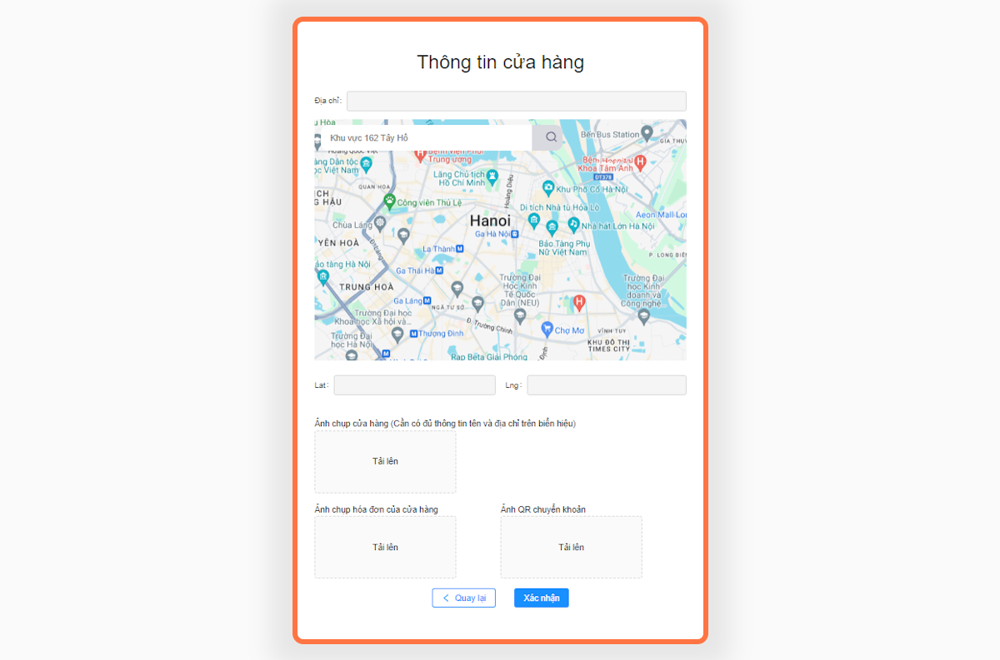
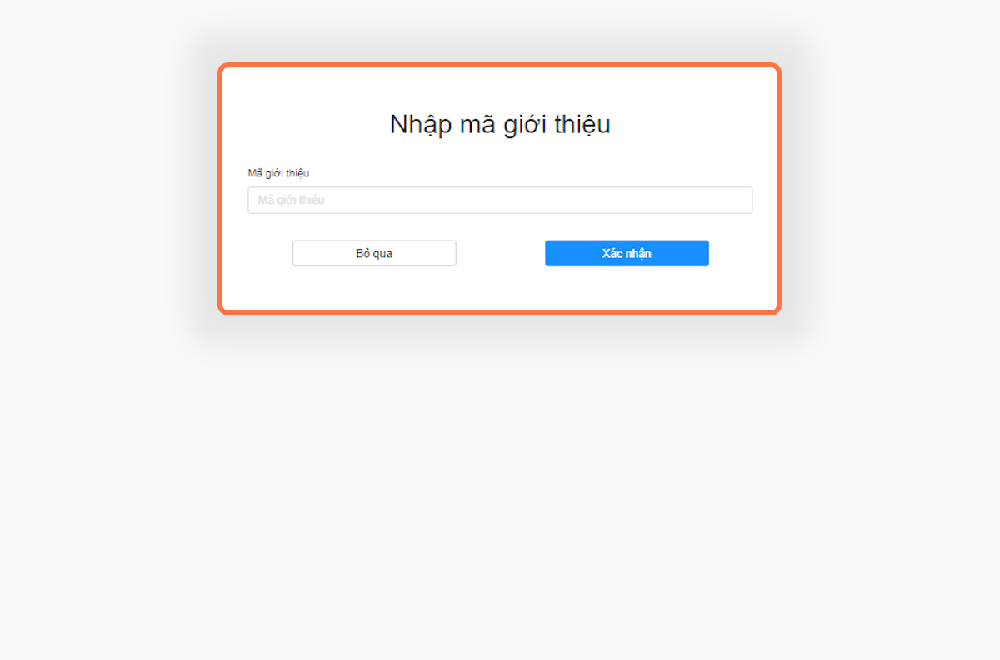

---
layout:
  title:
    visible: true
  description:
    visible: false
  tableOfContents:
    visible: true
  outline:
    visible: true
  pagination:
    visible: true
---

# 1.1. Đăng ký

Bước 1: Vào địa chỉ trang web


[**Địa chỉ: biz.locamos.vn**](https://biz.locamos.vn/)


<figure><figcaption></figcaption></figure>

* Bước 2: Nhấn vào nút đăng ký trên trang web&#x20;

<figure><figcaption></figcaption></figure>

* Bước 3: Chọn cách thức đăng ký

<figure><figcaption></figcaption></figure>

> Có thể chọn qua 2 hình thức đăng ký : Số điện thoại hoặc địa chỉ Email

* Bước 4: Nhập mã xác thực OTP

<figure><figcaption></figcaption></figure>

> Mã xác thực OTP sẽ được gửi qua tin nhắn điện thoại nếu đăng ký bằng Số điện thoại hoặc gửi qua thư điện tử nếu đăng ký bằng địa chỉ Email

* Bước 5: Nhập mật khẩu bạn muốn tạo

<figure><figcaption></figcaption></figure>

* Bước 6: Nhập các trường thông tin

<figure><figcaption></figcaption></figure>

> Nhập các trường thông tin bao gồm: Tên doanh nghiệp, tên chủ doanh nghiệp, mã số thuế, loại hình kinh doanh,... v.v


Lưu ý: Điền chính xác thông tin để LocaMos tiến hành xác thực.


* Bước 7: Nhập thông tin cửa hàng

<figure><figcaption></figcaption></figure>

> Điền thông tin vào bao gồm: Địa chỉ cửa hàng, Ảnh chụp hóa đơn và Ảnh QR chuyển khoản.


Lưu ý: Ảnh chụp hóa đơn và Ảnh QR chuyển khoản sau khi xác thực sẽ không thể thay đổi.



Muốn biết thêm chi tiết vui lòng liên hệ tới bộ phận CSKH của LocaMos:

* Số điện thoại:
* Địa chỉ Email:


* Bước 8: Nhập mã giới thiệu ( Nếu có)

<figure><figcaption></figcaption></figure>

> Nếu không có mã giới thiệu, nhấn bỏ qua

***
