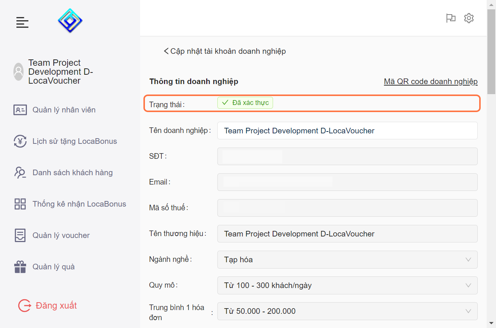

---
layout:
  title:
    visible: true
  description:
    visible: false
  tableOfContents:
    visible: true
  outline:
    visible: true
  pagination:
    visible: true
---

# 2.4. Kiểm tra trạng thái xác thực tài khoản

* Bước 1: Nhấn vào nút hình Răng cưa ở góc phải màn hình

<figure><figcaption></figcaption></figure>

* Bước 2: Chọn vào "Tài Khoản"

<figure><figcaption></figcaption></figure>

* Bước 3: Trạng thái tài khoản sẽ được hiển thị ở đây.

<figure><figcaption></figcaption></figure>


Lúc này doanh nghiệp của bạn đã gửi hồ sơ lên và chờ LocaMos xét duyệt


<figure><figcaption></figcaption></figure>


Tài khoản Doanh Nghiệp của bạn đã được xét duyệt


***
