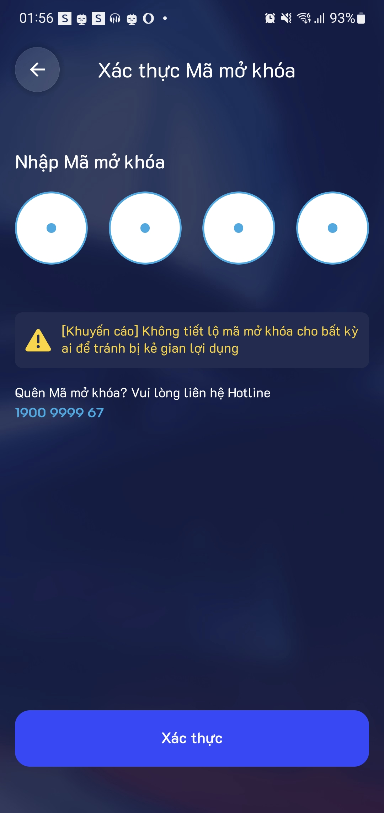

# 3.1. Liên kết tài khoản ứng dụng

* Bước 1: Đăng nhập vào trang quản lý


Biz.locamos.vn


<figure><figcaption></figcaption></figure>

* Bước 2: Nhấn vào phần "Quản lý CTKM"

<figure><figcaption></figcaption></figure>

* Bước 3: Nhấn vào "Tạo Mới"

<figure><figcaption></figcaption></figure>

* Bước 4: Nhập mã liên kết tài khoản

<figure><figcaption></figcaption></figure>

Mã Liên Kết được hiện ở: Mã liên kết trong ứng dụng LocaMos

Bước 1: Vào Ứng dụng LocaMos

.png>)

Bước 2: Vào "Mã liên kết" trong mục "Tài khoản"

<figure><figcaption></figcaption></figure>

Bước 2: Nhập mã Pin để xác thực

<figure><figcaption></figcaption></figure>

Bước 3: Mã liên kết được hiện thị tại đây

<figure><figcaption></figcaption></figure>
