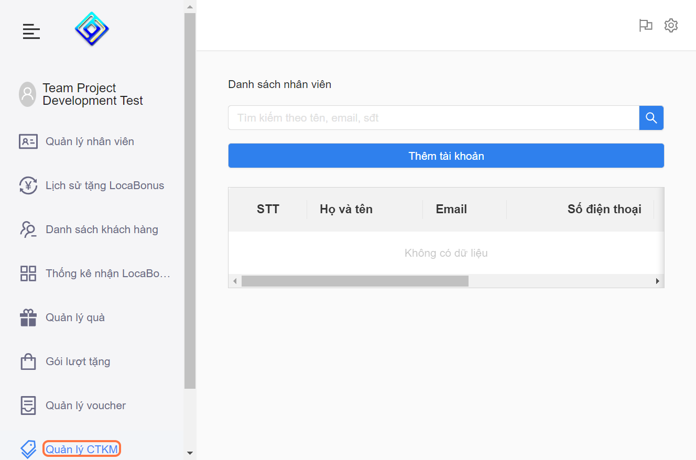
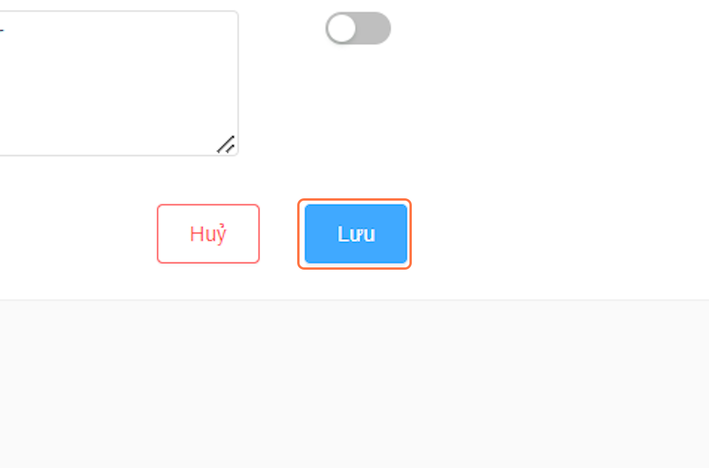

---
layout:
  title:
    visible: true
  description:
    visible: false
  tableOfContents:
    visible: true
  outline:
    visible: true
  pagination:
    visible: true
---

# 3.3. Chỉnh sửa chương trình khuyến mãi


Bạn chỉ được chỉnh sửa chương trình khuyến mãi trước khi được LocaMos duyệt, sau khi đã duyệt thì không sẽ được khả dụng quyền chỉnh sửa.



Nếu bắt buộc bạn có thể tạo chương trình khuyến mãi mới và ẩn cái cũ đi


* Bước 1: Vào "Quản Lý CTKM"

<figure><figcaption></figcaption></figure>

* Bước 2: Nhấn vào biểu tượng của mục "Xem"

<figure><figcaption></figcaption></figure>

* Bước 3: Nhấn vào biểu tượng "Sửa"

<figure><figcaption></figcaption></figure>

* Bước 4: Điều chỉnh lại thông tin cần sửa

<figure><figcaption></figcaption></figure>

* Bước 5: Nhấn vào "Lưu"

<figure><figcaption></figcaption></figure>
