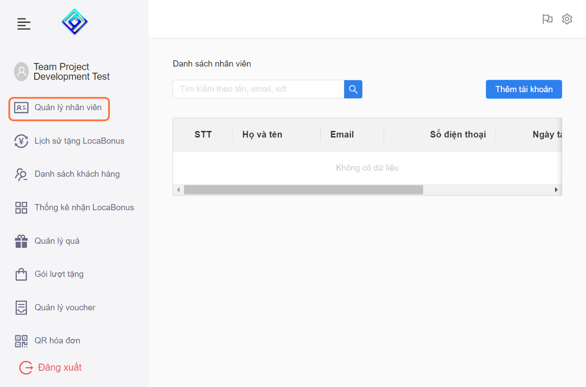

---
layout:
  title:
    visible: true
  description:
    visible: false
  tableOfContents:
    visible: true
  outline:
    visible: true
  pagination:
    visible: true
---

# 6.1. Thêm tài khoản Nhân Viên

* Bước 1: Chọn vào "Quản Lý Nhân Viên"

<figure><figcaption></figcaption></figure>

* Bước 2: Chọn vào "Thêm tài khoản"

<figure><figcaption></figcaption></figure>

* Bước 3: Điền thông tin của nhân viên

<figure><figcaption></figcaption></figure>

> Điền đúng và đủ thông tin cho nhân viên.

* Bước 4: Lưu lại

<figure><figcaption></figcaption></figure>

***
