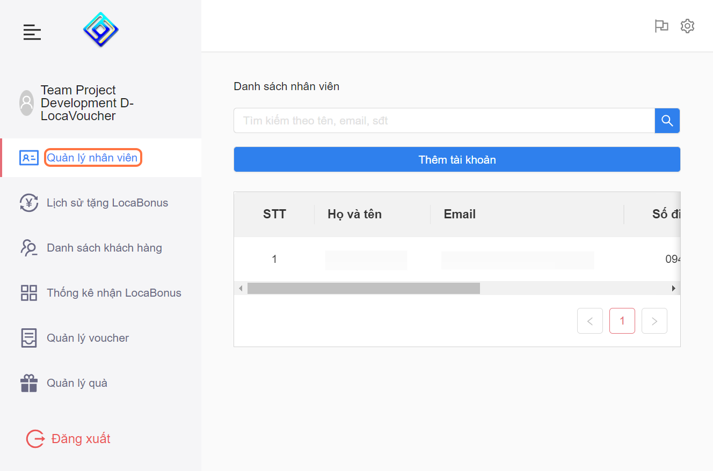

---
layout:
  title:
    visible: true
  description:
    visible: false
  tableOfContents:
    visible: true
  outline:
    visible: true
  pagination:
    visible: false
---

# 6.2. Chỉnh sửa thông tin tài khoản Nhân Viên

Bước 1: Chọn "Quản Lý Nhân Viên"

<figure><figcaption></figcaption></figure>

* Bước 2: Chọn tài khoản muốn chỉnh sửa

<figure><figcaption></figcaption></figure>

* Bước 3: Chọn "Chỉnh sửa"

<figure><figcaption></figcaption></figure>

* Bước 4: Nhập thông tin muốn chỉnh sửa

<figure><figcaption></figcaption></figure>

* Bước 5: Chọn vào lưu

<figure><figcaption></figcaption></figure>

***

