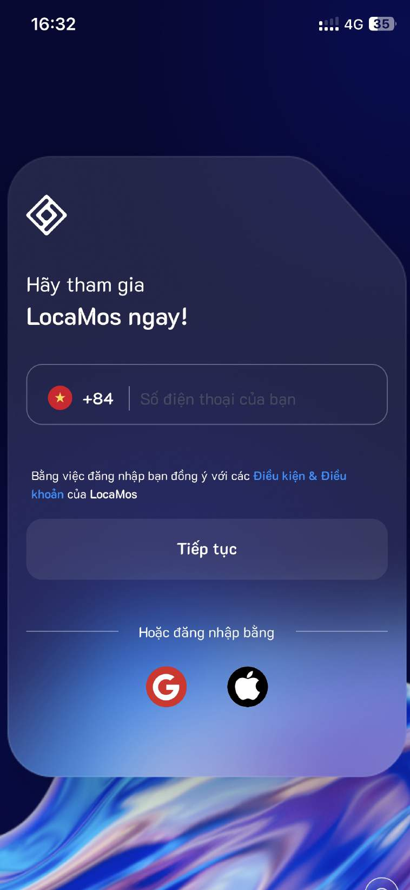

# 1.1. Đăng ký

Bước 1: Tải ứng dụng LocaMos từ cửa hàng ứng dụng CH Play hoặc Appstore.&#x20;


**Link Dowload:** [<mark style="color:purple;">**https://download.locameet.vn/**</mark>](https://download.locameet.vn/)


<figure><figcaption>
<mark style="color:red;"><strong>Tải ứng dụng trên Appstore</strong></mark>
</figcaption></figure>

<figure><figcaption>
<mark style="color:red;"><strong>Tải ứng dụng trên CH Play</strong></mark>
</figcaption></figure>

Bước 2: Nhập số điện thoại đăng ký

<figure><figcaption></figcaption></figure>

Bước 3: Nhập mã OTP được gửi về điện thoại

<figure><figcaption></figcaption></figure>

Bước 4: Tạo mật khẩu để đăng ký

<figure><figcaption></figcaption></figure>

Bước 5: Nhập mã giới thiệu (Nếu có)

<figure><figcaption></figcaption></figure>

Bước 6: Đăng ký thành công

<figure><figcaption></figcaption></figure>

