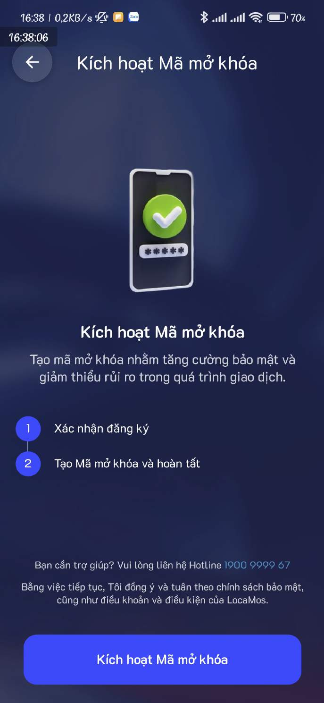
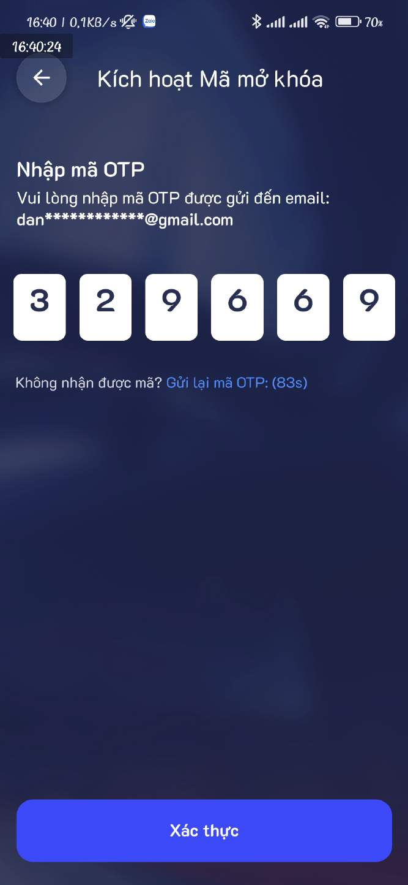
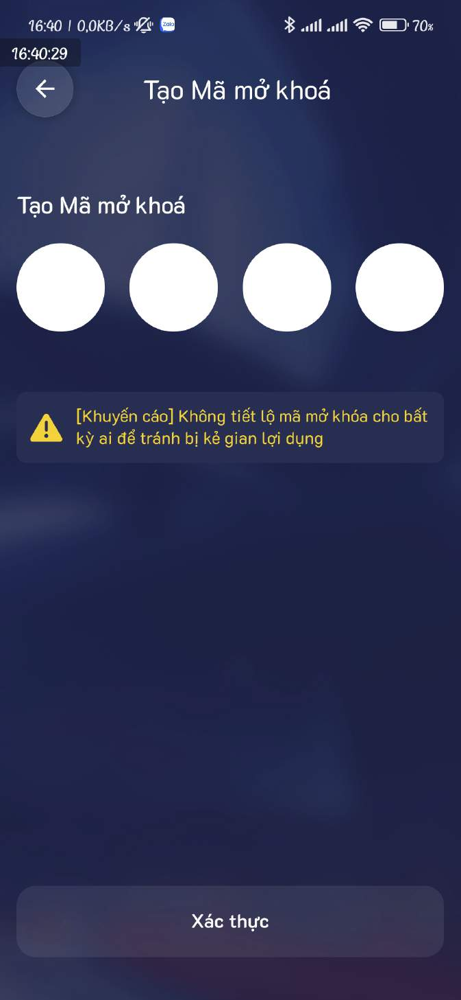
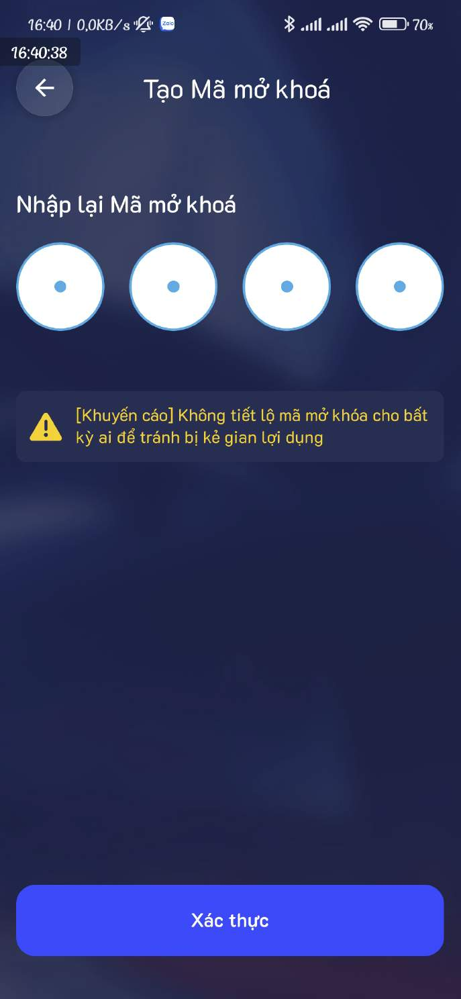

# 2.1. Hướng dẫn kích hoạt mã PIN

Bước 1: Vào biểu tượng "Người dùng"

<figure><figcaption></figcaption></figure>

Bước 2: Ấn vào "Kích hoạt mã mở khóa"

<figure><figcaption></figcaption></figure>

Bước 3: Kích hoạt Mã mở khóa

<figure><figcaption></figcaption></figure>

Bước 4: Nhập địa chỉ Email để nhận mã OTP

<figure><figcaption></figcaption></figure>

Bước 5: Nhập mã OTP được gửi về Email

<figure><figcaption></figcaption></figure>

Bước 6: Tạo mã OTP mới

<figure><figcaption></figcaption></figure>

Bước 7: Nhập lại mã PIN mới

<figure><figcaption></figcaption></figure>

Bước 8: Tạo mã PIN thành công

<figure><figcaption></figcaption></figure>
