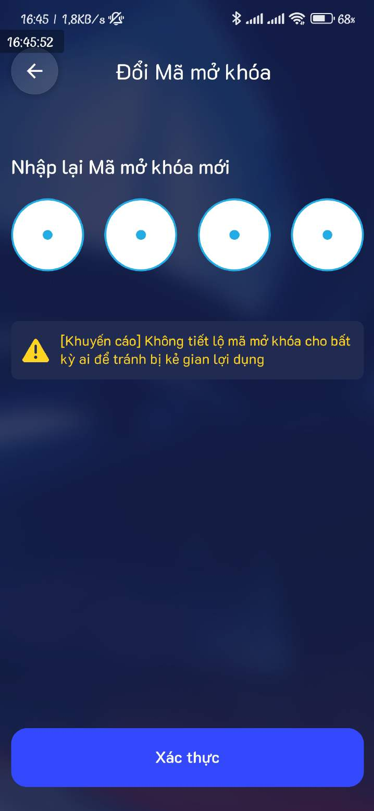

# 2.2. Hướng dẫn đổi mã PIN

Bước 1: Ấn vào biểu tượng" Người dùng"

<figure><figcaption></figcaption></figure>

Bước 2: Ấn vào "Kích hoạt Mã mở khóa"

<figure><figcaption></figcaption></figure>

Bước 3: Nhập mã Pin cũ

<figure><figcaption></figcaption></figure>

Bước 4: Tạo mã PIN mới

<figure><figcaption></figcaption></figure>

Bước 5: Nhập lại mã PIN mới

<figure><figcaption></figcaption></figure>

Bước 6: Thay đổi mã PIN mới thành công

<figure><figcaption></figcaption></figure>

